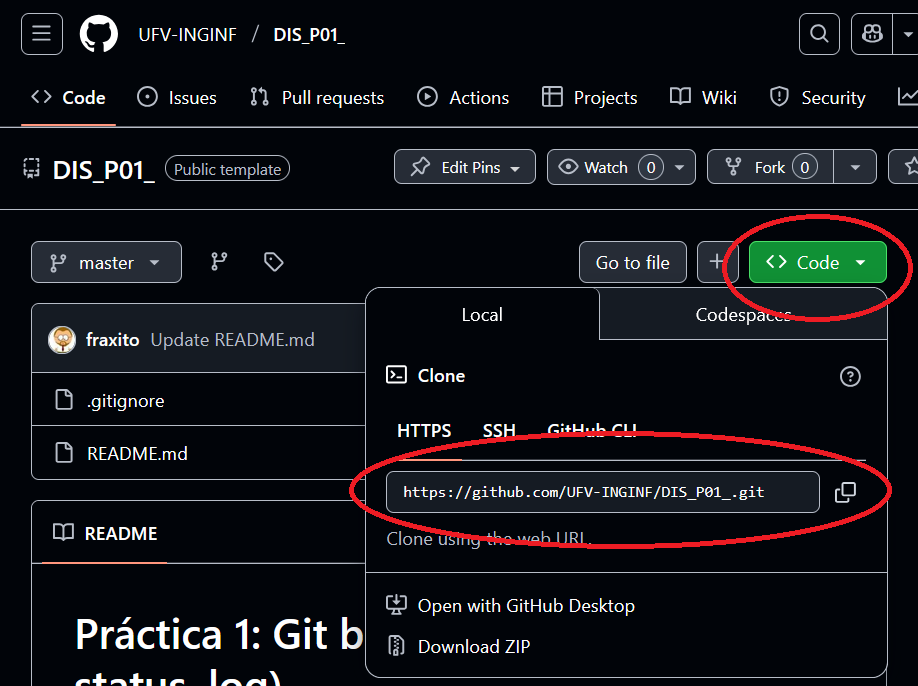

# Practice 1: Basic Git (add, commit, status, log)

## 🎯 Objective

Get familiar with the basic Git commands while working from the terminal:

- Add and modify files
- Make commits
- Check the repository status
- View the change history

## 🧪 Instructions

1. Accept the assignment from GitHub Classroom using the link provided by your teacher.

2. Clone your repository locally with Visual Studio Code:



```bash
git clone https://github.com/ufv-dis-2025/p1-git-basico-YOURUSERNAME.git
cd p1-git-basico-YOURUSERNAME
```

> You can also use `Git: Clone` from the Visual Studio Code command menu (`Ctrl + Shift + P`).

3. Open the folder in Visual Studio Code and open the integrated terminal (`Ctrl + ñ` or Terminal > New Terminal).

4. In the `tarea/` folder, open the file `mi_historia.txt` and write a short paragraph about a personal experience as a computer scientist (choose one):
   - How did you learn to program?
   - What was your first epic mistake?
   - A programming-related joke

5. Save the changes and make your first commit:

```bash
git status
git add .
git commit -m "First version of my personal story"
```

6. Edit the file again to add a second anecdote. Then make another commit:

```bash
git add .
git commit -m "Added second anecdote"
```

7. Use `git log` to see the change history and verify that everything was recorded.

## ✅ Submission

⚠️ **IMPORTANT:** Running `git commit` only saves the changes on your computer.
For us to receive and grade your work, **you must upload it to GitHub** with `git push`. (Check carefully whether your main branch is called `main` or `master`.)

```bash
git push origin main
```
or if your main branch is called `master`:
```bash
git push origin master
```
